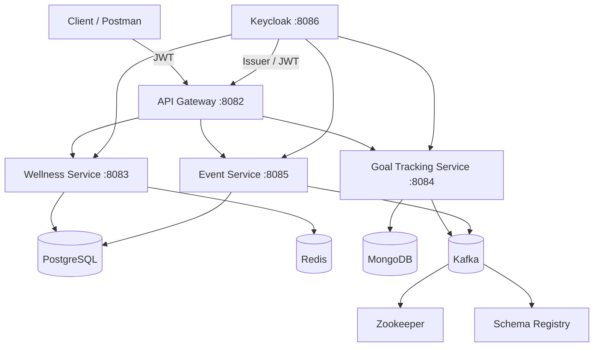

# Wellness Platform (Microservices) — Spring Boot + Keycloak + Kafka

A small event-driven "wellness platform" built as a **microservices system**:

- **API Gateway** (Spring Cloud Gateway)
- **Auth** with **Keycloak** (OIDC / JWT)
- **Wellness Service**: wellness resources (PostgreSQL + Redis cache)
- **Goal Tracking Service**: student goals (MongoDB) + publishes Kafka events
- **Event Service**: events CRUD (PostgreSQL) + role-based access

Everything runs via **Docker Compose** and is wired for **service-to-service communication**, **circuit breaking** (Resilience4j), and **OpenAPI/Swagger**.

> Note: the repo structure was initially bootstrapped from a generic GitLab project template; the microservices, integrations, and configs were implemented/extended for a COMP3095 assignment-style system.

## Architecture



## Tech stack

- Java 21, Spring Boot 3
- Spring Cloud Gateway, Spring Security (OAuth2 Resource Server)
- Keycloak (realm import included)
- PostgreSQL, MongoDB, Redis
- Apache Kafka (Confluent images)
- Testcontainers (integration tests)

## Quickstart (Docker)

**Requirements:** Docker Desktop

```bash
docker compose up --build
```

When everything is up:

- API Gateway: `http://localhost:8082`
- Keycloak: `http://localhost:8086`

### Default users

Realm: `gbc-realm`

- Student: `student1` / `password`
- Staff: `staff1` / `password`

### Smoke test

This script fetches tokens from Keycloak and hits each service through the gateway.

> Requires `jq`.

```bash
bash scripts/test-api.sh
```

## Useful endpoints

Through the gateway (`:8082`):

- Wellness resources: `GET /api/resources`
- Goal tracking: `GET /api/goals`
- Events: `GET /api/events`

Swagger (service-by-service):

- Wellness: `http://localhost:8083/swagger-ui.html`
- Goals: `http://localhost:8084/swagger-ui.html`
- Events: `http://localhost:8085/swagger-ui.html`

## Running tests

Each service is its own Gradle project.

```bash
cd wellness-service && ./gradlew test
cd ../goal-tracking-service && ./gradlew test
```

## Repo notes (for recruiters)

This project showcases:

- **Microservices + API Gateway routing**
- **JWT auth** with Keycloak + role-based authorization
- **Event-driven messaging** (Kafka) for cross-service workflows
- **Polyglot persistence**: PostgreSQL + MongoDB + Redis
- **Resilience patterns**: Circuit breaker + fallback
- **Integration tests** using Testcontainers
